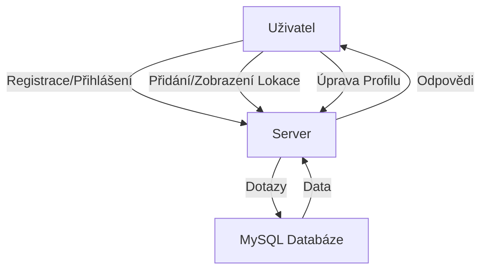

# HerrmanTP

## Overview

HerrmanTP is a web application designed to manage and share locations. Users can register, log in, add, view, and rate various locations. The application leverages Node.js, Express, MySQL, and Bootstrap for a responsive and user-friendly experience.

## Project Context

HerrmanTP was developed as a part of a web development project to demonstrate the integration of various technologies and to provide a practical solution for location management. The project was released to help users easily share and discover interesting places.

## Project Goals

The primary goal of HerrmanTP is to provide a platform where users can manage and share locations. It aims to solve the problem of discovering and rating locations by allowing users to add detailed information, including descriptions and ratings.

## Project Focus

HerrmanTP focuses on the following functionalities:
- User registration and login
- Adding, viewing, and rating locations
- User profile management
- Responsive design using Bootstrap

## Target Audience

HerrmanTP is intended for users who are interested in discovering and sharing locations. It is suitable for individuals who want to keep track of their favorite places, share them with others, and explore new locations based on user ratings and reviews.

## Installation

1. Clone the repository:
    ```bash
    git clone https://github.com/yourusername/HerrmanTP.git
    cd HerrmanTP
    ```

2. Install dependencies:
    ```bash
    npm install
    ```

3. Set up the MySQL database:
    - Create a MySQL database named `herrmanTP`.
    - Run the SQL script to create tables and insert mock data:
        ```bash
        mysql -u root -p < schema.sql
        ```

4. Start the server:
    ```bash
    npm start
    ```

5. Open your browser and navigate to `http://localhost:3000`.

## Project Structure

```
HerrmanTP/
├── public/
│   ├── index.html
│   ├── Locations.html
│   ├── profile.html
│   ├── script.js
│   ├── profile.js
│   ├── styles.css
├── server.js
├── schema.sql
├── package.json
├── package-lock.json
└── README.md
```

## API Endpoints

### User Authentication

- **POST /login**
    - Logs in a user.
    - Request body: `{ "username": "string", "password": "string" }`
    - Response: Redirects to `/locations` on success.

- **POST /register**
    - Registers a new user.
    - Request body: `{ "username": "string", "email": "string", "password": "string" }`
    - Response: Redirects to `/locations` on success.

### User Profile

- **GET /api/username**
    - Fetches the current user's username.
    - Response: `{ "username": "string" }`

- **GET /api/user-info**
    - Fetches the current user's information.
    - Response: `{ "username": "string", "email": "string", "locationCount": "number" }`

- **POST /api/edit-user**
    - Edits the current user's information.
    - Request body: `{ "username": "string", "email": "string", "password": "string" }`
    - Response: `200 OK` on success.

### Locations

- **GET /api/locations**
    - Fetches all locations.
    - Response: `[{ "id": "number", "name": "string", "address": "string", "description": "string", "iframe": "string", "added_by": "string", "rating": "number" }]`

- **POST /add-location**
    - Adds a new location.
    - Request body: `{ "name": "string", "address": "string", "description": "string", "iframe": "string", "added_by": "string", "rating": "number" }`
    - Response: Redirects to `/locations` on success.

- **GET /api/user-locations**
    - Fetches locations added by the current user.
    - Response: `[{ "id": "number", "name": "string", "address": "string", "description": "string", "iframe": "string", "added_by": "string", "rating": "number" }]`

## Features

### Feature A: Přihlášení, Registrace

Users can register and log in to the application. The registration form collects a username, email, and password, while the login form requires a username and password.

```html
<!-- Registration Form -->
<form id="register-form" action="/register" method="POST">
    <div class="mb-3 text-light">
        <label for="register-username" class="form-label">Uživatelské jméno</label>
        <input type="text" class="form-control" id="register-username" name="username" required>
    </div>
    <div class="mb-3 text-light">
        <label for="register-email" class="form-label">Email</label>
        <input type="email" class="form-control" id="register-email" name="email" required>
    </div>
    <div class="mb-3 text-light">
        <label for="register-password" class="form-label">Heslo</label>
        <input type="password" class="form-control" id="register-password" name="password" required>
    </div>
    <button type="submit" class="btn btn-primary w-100">Registrovat</button>
</form>
```

### Feature B: Přidání Lokace

Users can add new locations by providing details such as name, address, description, Google Maps iframe, and rating. The form is displayed in a modal.

```html
<!-- Add Location Modal -->
<div class="modal fade" id="addLocationModal" tabindex="-1" aria-labelledby="addLocationModalLabel" aria-hidden="true">
    <div class="modal-dialog">
        <div class="modal-content">
            <div class="modal-header">
                <h5 class="modal-title" id="addLocationModalLabel">Přidat lokaci</h5>
                <button type="button" class="btn-close" data-bs-dismiss="modal" aria-label="Zavřít"></button>
            </div>
            <div class="modal-body">
                <form id="add-location-form" action="/add-location" method="POST">
                    <div class="mb-3">
                        <label for="name" class="form-label">Název</label>
                        <input type="text" class="form-control" id="name" name="name" required>
                    </div>
                    <div class="mb-3">
                        <label for="address" class="form-label">Adresa</label>
                        <input type="text" class="form-control" id="address" name="address" required>
                    </div>
                    <div class="mb-3">
                        <label for="description" class="form-label">Popis</label>
                        <textarea class="form-control" id="description" name="description" required></textarea>
                    </div>
                    <div class="mb-3">
                        <label for="iframe" class="form-label">Google Maps Iframe</label>
                        <textarea class="form-control" id="iframe" name="iframe" required></textarea>
                    </div>
                    <div class="mb-3">
                        <label for="added_by" class="form-label">Přidal</label>
                        <input type="text" class="form-control" id="added_by" name="added_by" required readonly>
                    </div>
                    <div class="mb-3">
                        <label for="rating" class="form-label">Hodnocení (1-5)</label>
                        <input type="number" class="form-control" id="rating" name="rating" min="1" max="5" required>
                    </div>
                    <button type="submit" class="btn btn-primary">Přidat lokaci</button>
                </form>
            </div>
        </div>
    </div>
</div>
```

### Feature C: Zobrazení Lokací

Users can view a list of all locations. Each location is displayed with its name, address, description, Google Maps iframe, and rating. Users can click a button to view more details in a modal.

```javascript
// Fetch and display locations
fetch("/api/locations")
    .then((response) => response.json())
    .then((locations) => {
        const locationsList = document.getElementById("locations-list");
        locations.forEach((location, index) => {
            const iframe = location.iframe
                .replace(/width="\d+"/, 'width="400"')
                .replace(/height="\d+"/, 'height="300"');
            const locationDiv = document.createElement("div");
            locationDiv.classList.add("location");
            locationDiv.innerHTML = `
                <div class="text-center mt-5">
                    <h3>${location.name}</h3>
                    <div>${iframe}</div>
                </div>
                <div class="d-flex justify-content-center flex-column text-center mx-3">
                    <p>${location.address}</p>
                    <p><b>Přidal: ${location.added_by}</p>
                    <p class="fw-bold">Hodnocení: ${location.rating} / 5</p>
                    <button class="btn btn-primary" data-bs-toggle="modal" data-bs-target="#locationModal${index}">Zobrazit více</button>
                </div>
                
                <!-- Modal -->
                <div class="modal fade" id="locationModal${index}" tabindex="-1" aria-labelledby="locationModalLabel${index}" aria-hidden="true">
                    <div class="modal-dialog">
                        <div class="modal-content">
                            <div class="modal-header">
                                <h5 class="modal-title" id="locationModalLabel${index}">${location.name}</h5>
                                <button type="button" class="btn-close" data-bs-dismiss="modal" aria-label="Zavřít"></button>
                            </div>
                            <div class="modal-body">
                                <div>${iframe}</div>
                                <p>${location.address}</p>
                                <p><b>Popis</b></p>
                                <p>${location.description}</p>
                                <p>Přidal: ${location.added_by}</p>
                                <p class="fw-bold">Hodnocení: ${location.rating} / 5</p>
                            </div>
                        </div>
                    </div>
                </div>`;
            locationsList.appendChild(locationDiv);
        });
    })
    .catch((error) => console.error("Chyba při načítání lokací:", error));
```

### Feature D: Uživatelský Profil

Users can view and edit their profile information, including username, email, and password. The profile page also displays the number of locations added by the user.

```javascript
// Fetch user information
fetch("/api/user-info")
    .then((response) => response.json())
    .then((user) => {
        const userInfoDiv = document.getElementById("user-info");
        userInfoDiv.innerHTML = `
            <h2>Uživatelské informace</h2>
            <p><b>Uživatelské jméno:</b> ${user.username}</p>
            <p><b>Email:</b> ${user.email}</p>
            <p><b>Počet přidaných lokací:</b> ${user.locationCount}</p>
            <button class="btn btn-primary" data-bs-toggle="modal" data-bs-target="#editUserModal">Upravit informace</button>
            
            <!-- Edit User Modal -->
            <div class="modal fade" id="editUserModal" tabindex="-1" aria-labelledby="editUserModalLabel" aria-hidden="true">
                <div class="modal-dialog">
                    <div class="modal-content">
                        <div class="modal-header">
                            <h5 class="modal-title" id="editUserModalLabel">Upravit informace</h5>
                            <button type="button" class="btn-close" data-bs-dismiss="modal" aria-label="Zavřít"></button>
                        </div>
                        <div class="modal-body">
                            <form id="edit-user-form">
                                <div class="mb-3">
                                    <label for="edit-username" class="form-label">Uživatelské jméno</label>
                                    <input type="text" class="form-control" id="edit-username" name="username" value="${user.username}" required>
                                </div>
                                <div class="mb-3">
                                    <label for="edit-email" class="form-label">Email</label>
                                    <input type="email" class="form-control" id="edit-email" name="email" value="${user.email}" required>
                                </div>
                                <div class="mb-3">
                                    <label for="edit-password" class="form-label">Nové heslo</label>
                                    <input type="password" class="form-control" id="edit-password" name="password">
                                </div>
                                <button type="submit" class="btn btn-primary">Uložit změny</button>
                            </form>
                        </div>
                    </div>
                </div>
            </div>
        `;

        // Handle form submission for editing user information
        const editUserForm = document.getElementById("edit-user-form");
        editUserForm.addEventListener("submit", (e) => {
            e.preventDefault();
            const formData = new FormData(editUserForm);
            fetch("/api/edit-user", {
                method: "POST",
                body: formData,
            })
                .then((response) => {
                    if (response.ok) {
                        window.location.reload();
                    } else {
                        console.error("Failed to update user information");
                    }
                })
                .catch((error) => console.error("Error updating user information:", error));
        });
    })
    .catch((error) => console.error("Error fetching user information:", error));
```

## Analýza a návrh

### Analýza problému

Identifikovali jsme několik problémů, které aplikace HerrmanTP řeší:
- Obtížnost při hledání a sdílení zajímavých míst.
- Nedostatek centralizované platformy pro hodnocení a recenze míst.
- Potřeba snadného způsobu, jak spravovat a sdílet oblíbená místa.

### Požadavky

Funkční požadavky:
- Uživatelé musí být schopni se registrovat a přihlašovat.
- Uživatelé musí být schopni přidávat, zobrazovat a hodnotit lokace.
- Uživatelé musí mít možnost spravovat svůj profil.

Nefunkční požadavky:
- Aplikace musí být responzivní a uživatelsky přívětivá.
- Data musí být bezpečně uložena a chráněna.
- Aplikace musí být schopna zvládnout více uživatelů současně.

### Diagram

Následující diagram znázorňuje, jak jednotlivé komponenty aplikace HerrmanTP spolupracují:



## License

This project is licensed under the MIT License.